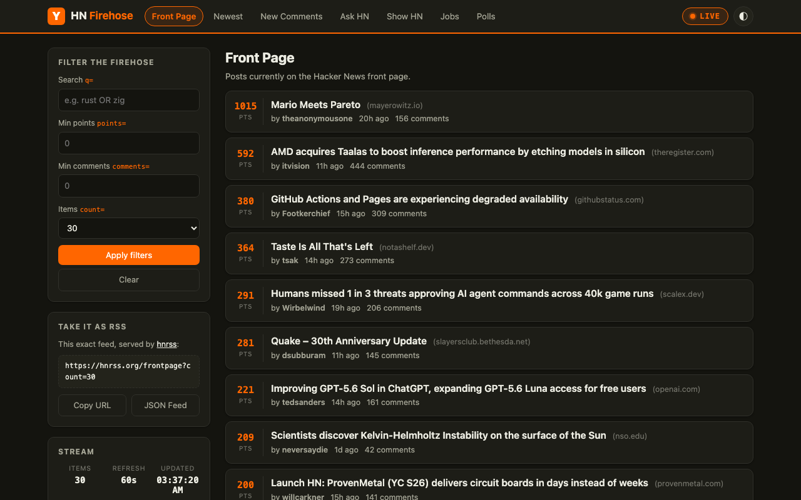

# HN Firehose

A live, zero-build Hacker News reader inspired by the firehose feeds of
[hnrss](https://hnrss.github.io/).



## Feeds

Mirrors the hnrss feed catalog as live in-page streams:

| Tab | hnrss equivalent |
| --- | --- |
| Front Page | `hnrss.org/frontpage` |
| Newest | `hnrss.org/newest` |
| New Comments | `hnrss.org/newcomments` |
| Ask HN / Show HN / Jobs / Polls | `hnrss.org/ask`, `/show`, `/jobs`, `/polls` |

## Features

- **Live streaming** — polls every 60s; new items slide in at the top when you're
  at the top of the page, otherwise queue behind a "Show N new items" button so
  the page never jumps under you. Pausable via the LIVE toggle.
- **hnrss-style filters** — `q=` keyword search, `points=` minimum score,
  `comments=` minimum comment count, `count=` page size.
- **Infinite scroll** — older pages load automatically as you approach the
  bottom of the stream.
- **RSS hand-off** — the sidebar always shows the `hnrss.org` URL for the exact
  feed + filters you're looking at (copy as RSS, or open as JSON Feed).
- **Dark/light theme**, responsive layout, no framework, no build step.

## Data source

The [Algolia HN Search API](https://hn.algolia.com/api) (the same data hnrss is
built on), fetched client-side — so the site is three static files.

## Run

```
python3 -m http.server 4173
```

then open <http://localhost:4173>. Any static file server works.

## Mac app

A native macOS wrapper (AppKit + WKWebView, no Electron) lives in `macos/`:

```
./macos/build.sh
open "dist/HN Firehose.app"
```

The build compiles `macos/main.swift`, renders the app icon, copies the three
web files into the bundle, and ad-hoc signs it. To package a shareable disk
image (`dist/HN-Firehose-<version>.dmg`, with the usual drag-to-Applications
layout):

```
./macos/make-dmg.sh
```

The app is ad-hoc signed, not notarized — people you share it with will need
to right-click → Open the first time (or run
`xattr -d com.apple.quarantine "/Applications/HN Firehose.app"`). Story/comment links open in
your default browser; ⌘R reloads; the window position is remembered. Note the
web assets are copied into the bundle at build time, so re-run `build.sh`
after editing them.
